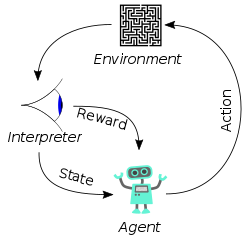

# The Learners JS

**This is a beta project**

The Learners JS is a template of trainable bot to training models to [Lugo Bots](https://beta.lugobots.dev/).

## How to use the code

Implement the interface `BotTrainer` based on the reinforcement scenario you want to build.



```javascript
interface BotTrainer {
  /**
   * (not seen at the picture above)
   * createNewInitialState should create the initial scenario for each game.
   *
   * IMPORTANT!! Note that this method should define the new state directly on the game server. So you MUST
   * use the remote control client to change the game elements' position/state
   *
   * @param {any} data - Pass any data you need to during the training session
   */
  createNewInitialState: (data: any) => Promise<GameSnapshot>;
  
  /**
   * (The "interprefer" at the picture above)
   * 
   * getInputs is called in each training step.
   * The training function will call this method to receive whatever inputs you want to use in your neural network.
   * Example, if you have 3 sensors, or 3 tensors, etc.
   *
   * This method must read the game snapshot and define input values and return it
   *
   * @param {GameSnapshot} snapshot - The current game state
   */
  getState: (snapshot: GameSnapshot) => any;
  
  /**
   * (The "agent" at the picture above, but instead of chosing an action, executes it on the environment (game))
   * play defines the orders that will be sent to the game server based on the `action` sent by your training function.
   *
   * IMPORTANT:
   * Do not confuse this method role with an agent! Your agent will define the `action` inside your training function.
   * This method is only responsible to translate the action to orders and send them
   *
   * @param {OrderSet} orderSet - used to define the orders that will be sent to the server. Your bot should set the orders
   *                      and return it to the server.
   * @param {GameSnapshot} snapshot - The current game state
   * @param {any} action - Value passed by your training function to the TrainingController `update` method
   *
   */
  play: (orderSet: OrderSet, snapshot: GameSnapshot, action: any) => Promise<OrderSet>;
  
  /**
   * (also the "interprefer" at the picture above)
   * This method is called by the TrainingController right after your bot play a turn of the game.
   * It must compare the two states and return the reward and a boolean `done` to indicate that the game each the end.
   *
   * Your bot may evaluate turn by turn, or comparing the final game state to the initial state.
   * However, if you want to compare with the initial state, your bot trainer will have to store the initial
   * state when the method `createNewInitialState` is called.
   *
   * @param {GameSnapshot} previousSnapshot - The current game state
   * @param {GameSnapshot} newSnapshot - The current game state
   */
  evaluate: (previousSnapshot: GameSnapshot, newSnapshot: GameSnapshot) => Promise<{
    reward: number;
    done: boolean;
  }>;
}

```
Read for more details: https://github.com/lugobots/lugo4node/blob/master/src/rl/Readme.md

## Set the environment up

1. `npm install`
2. `npm run watch` (skip this step if you have not edit any file)
3. In another terminal, `docker run -p 8080:8080 -p 5000:5000 lugobots/server play --dev-mode --timer-mode=remote`

   Or, you may [download the Game Server binaries at https://hub.docker.com/r/lugobots/server](https://hub.docker.com/r/lugobots/server) that will get a significantly higher performance:
    ```shell
    # Executin the binary on Linux
    ./lugo_server play --dev-mode --timer-mode=remote
    ```
4. In a third terminal `npm run start`


### 2nd Step: (optional) Run another bot

**Note** The initial example is design to training with static bots. Run against another bot if your BotTrainer expected real players.

Run `docker compose -f docker-compose-away-team.yml up` to run against the official bot Level-1 (aka The Dummies Go)


## Creating your model

This template has a very simple example where the bot has sensors to detect opponents and uses a Q-learning algorithm to create some learning.

Now, you should on the `myTrainingFunction` in the [index.ts](src/index.ts) file to create your own model.

The training function wil receive a `TrainingController` that will provide the methods to control the training flow. 


```javascript
interface TrainingController {
    /**
     * This method should be called whenever your need to reset the game to an initial state.
     *
     * @param {any} data - Pass any data you need to during the training session
     */
    setEnvironment: (data: any) => Promise<void>;

    /**
     * Use this method to get the inputs that will be used by your model. E.g. if you are using tensor flow, you may
     * return the tensors used to feed your network.
     */
    getState: () => any;

    /**
     * Use this method to pass that action picked by you model. It will return the reward and `done` values got from
     * your BotTrainer.
     * @param action
     * @returns {Promise<{reward: number, done: boolean}>}
     */
    update: (action: any) => Promise<{ reward: number, done: boolean }>;

    /**
     * Stops the training
     */
    stop: () => Promise<void>;
}
```

## After training your model

This code is only meant to training your model, it won't build a final bot.


When your model is ready to play, create a bot using the bot template ([The dummies](https://github.com/lugobots/the-dummies-js)) and use the model
to help your bot takes its decisions.
